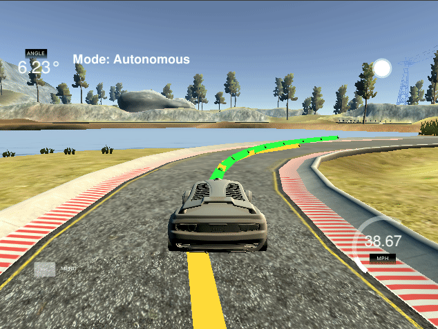

# Model Predictive Control Project
[](http://www.udacity.com/drive)

Overview
---
This repository contains my implementation of the Model Predictive Control project (Term 2 - Project 5) in Udacity's Self-Driving Car Nanodegree Program.
The goal of the project is to implement a MPC to race around the lake track in the driving simulator.

## Implementation (Rubric Points)


### The Model

The state vector:
```
x // x-position
y  // y-position
psi // heading angle
v  // velocity
cte // cross track error
epsi // heading eror
```

The actuators:
```
a // acceleeration
delta // steering angle
```

Update equations:
```
AD<double> f0 = coeffs[0] + coeffs[1] * x0 + coeffs[2] * x0*x0 + coeffs[3]* x0*x0*x0; 
AD<double> psides0 = CppAD::atan(coeffs[1] + 2 * coeffs[2] * x0  + 3 * coeffs[3] * x0 * x0);

fg[1 + x_start + t] = x1 - (x0 + v0 * CppAD::cos(psi0) * dt);
fg[1 + y_start + t] = y1 - (y0 + v0 * CppAD::sin(psi0) * dt);
fg[1 + psi_start + t] = psi1 - (psi0 + v0 * delta0 / Lf * dt);
fg[1 + v_start + t] = v1 - (v0 + a0 * dt);
fg[1 + cte_start + t] = cte1 - ((f0 - y0) + (v0 * CppAD::sin(epsi0) * dt));
fg[1 + epsi_start + t] = epsi1 - ((psi0 - psides0) + v0 * delta0 / Lf * dt);
```

### Timestep Length and Elapsed Duration

The timestep number was set to `N=10` and the single timestep length to `dt = 0.1` resulting in a total length of 1 second. 
The reference speed was set to `ref_v = 40`.


### Polynomial Fitting and MPC Preprocessing
First the waypoints are transformed into the vehicle's coordinate system: 
```
for (int i = 0;   i < ptsx.size() ;   i++) {
  waypoints_x_car_space(i) = (ptsx[i] - px) * cos(-psi) - (ptsy[i] - py) * sin(-psi);
  waypoints_y_car_space(i) = (ptsy[i] - py) * cos(-psi) + (ptsx[i] - px) * sin(-psi);
}
```

In car-space, the car's x,y and psi values are zero.
A 3rd order polynomial is fitted to the waypoints (in car coordinate system).
Afterwards the CTE and the EPSI are calculated.
```    
double car_x_car_space = 0.0;
double car_y_car_space = 0.0;
double car_psi_car_space = 0.0;

auto coeffs = polyfit(waypoints_x_car_space, waypoints_y_car_space, 3);

// Calculate cte: f(x) - y
double cte = polyeval(coeffs, car_x_car_space) - car_y_car_space;

// Calculate epsi = psi - atan(f'(x))
double epsi = car_psi_car_space - atan(coeffs[1] + 2*coeffs[2]*car_x_car_space + 3*coeffs[3]*car_x_car_space*car_x_car_space);
```

Finally the current state vector is fed into the MPC solver:
```   
state << car_x_car_space, car_y_car_space, car_psi_car_space, v, cte, epsi;
MPCData solution = mpc.Solve(state, coeffs);
```
         
### Model Predictive Control with Latency

In order to deal with latency, the state after that delay is predicted prior to the transformation of the waypoints into the vehicle's coordinate system. 

```   
px = px + v* 0.44704 * cos(psi)*latency;  // 0.44704 --> convert from mph to m/s
py = py + v* 0.44704 * sin(psi)*latency;
psi = psi - v* 0.44704 *delta/Lf*latency; // steering angle negative
```

### Cost Function Weights

This snipped shows the manually tuned weights of the cost function in order to achieve the final output.
```   
    for (int t = 0; t < N; t++) {
      fg[0] += 100*CppAD::pow(vars[cte_start + t], 2);
      fg[0] += 150*CppAD::pow(vars[epsi_start + t], 2);
      fg[0] += CppAD::pow(vars[v_start + t] - ref_v, 2);
    }

    for (int t = 0; t < N - 1; t++) {
      fg[0] += 500*CppAD::pow(vars[delta_start + t], 2);
      fg[0] += CppAD::pow(vars[a_start + t], 2);
    }

    for (int t = 0; t < N - 2; t++) {
      fg[0] += 1500*CppAD::pow(vars[delta_start + t + 1] - vars[delta_start + t], 2);
      fg[0] += 100*CppAD::pow(vars[a_start + t + 1] - vars[a_start + t], 2);
    }
```


## Demo

The implementation resulted in the following output: 

  

The vehicle stays on the track during the whole circuit. 


## Running the Code
This project involves the Term 2 Simulator which can be downloaded [here](https://github.com/udacity/self-driving-car-sim/releases)

This repository includes two files that can be used to set up and intall uWebSocketIO for either Linux or Mac systems. For windows you can use either Docker, VMware, or even Windows 10 Bash on Ubuntu to install uWebSocketIO.

Once the install for uWebSocketIO is complete, the main program can be built and ran by doing the following from the project top directory.

1. mkdir build
2. cd build
3. cmake ..
4. make
5. ./mpc


## Dependencies

* cmake >= 3.5
 * All OSes: [click here for installation instructions](https://cmake.org/install/)
* make >= 4.1(mac, linux), 3.81(Windows)
  * Linux: make is installed by default on most Linux distros
  * Mac: [install Xcode command line tools to get make](https://developer.apple.com/xcode/features/)
  * Windows: [Click here for installation instructions](http://gnuwin32.sourceforge.net/packages/make.htm)
* gcc/g++ >= 5.4
  * Linux: gcc / g++ is installed by default on most Linux distros
  * Mac: same deal as make - [install Xcode command line tools]((https://developer.apple.com/xcode/features/)
  * Windows: recommend using [MinGW](http://www.mingw.org/)
* [uWebSockets](https://github.com/uWebSockets/uWebSockets)
  * Run either `install-mac.sh` or `install-ubuntu.sh`.
  * If you install from source, checkout to commit `e94b6e1`, i.e.
    ```
    git clone https://github.com/uWebSockets/uWebSockets
    cd uWebSockets
    git checkout e94b6e1
    ```
    Some function signatures have changed in v0.14.x. See [this PR](https://github.com/udacity/CarND-MPC-Project/pull/3) for more details.

* **Ipopt and CppAD:** Please refer to [this document](https://github.com/udacity/CarND-MPC-Project/blob/master/install_Ipopt_CppAD.md) for installation instructions.
* [Eigen](http://eigen.tuxfamily.org/index.php?title=Main_Page). This is already part of the repo so you shouldn't have to worry about it.
* Simulator. You can download these from the [releases tab](https://github.com/udacity/self-driving-car-sim/releases).
* Not a dependency but read the [DATA.md](./DATA.md) for a description of the data sent back from the simulator.


